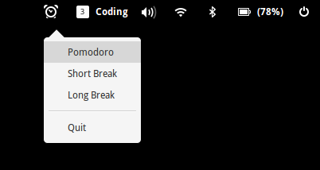
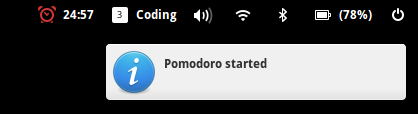
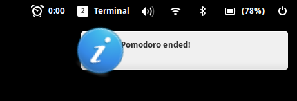

# Pomodoro Indicator

For Elementary OS or Ubuntu.

## Screenshots








## Usage

This software is not yet available from a public repository. However, you may clone this repository and run it locally.

### Initial setup

```
# Install the dependencies
sudo apt install python-gi

# Clone the repo
git clone https://github.com/atduarte/indicator-pomodoro.git
cd indicator-pomodoro

# Copy the icons (optional, but recommended)
sudo cp -r usr /
```

### Running the app

Now you can simply run the app.

```
python indicator.py
```

That's it! You can also make the indicator run on statup by adding `python /path/to/repo/indicator.py` to your startup applications in System Settings > Applications > Startup.


## To Do

* Create a Debian package and describe usage
* Add screenshots
* Automatic pomodoro flow (pomodoro > short break > pomodoro > short break > pomodoro > long break)
* Replace icon with a tomato
* Show different color when timer is a break (green)
* Add configurable times
